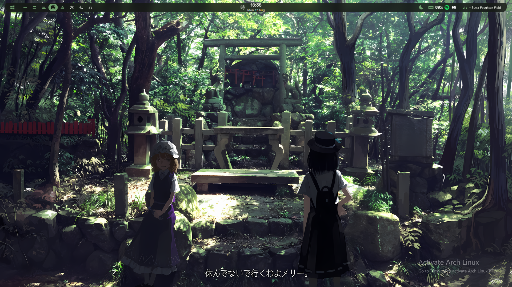
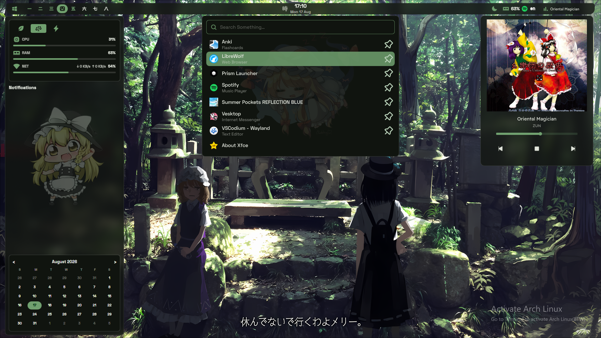

# Eastern-Shell

> 宇宙を飛び不思議な巫女。。。


---



##




## Keeping Track Of:

| Tool | Description | Configuration Path |
| :--- | :--- | :--- |
| **Shell** | Zsh configs & custom aliases | `~/.zshrc` |
| **Hyprland** | The config files for hyprland | `~/.config/hypr` |
| **Quickshell** | Bar, Modules, etc... | `~/.config/quickshell` |
| **Editor** | Neovim plugins, keymaps, and LSP settings | `~/.config/nvim/` |
| **Git** | Global git settings & custom command shortcuts | `~/.gitconfig` |
| **Matugen** | Get your wallpaper's color across the setup | `~/.config/matugen`
---

## Add New Device

```bash
# 1. Authenthicate New Device:
ssh-keygen -t ed25519 -C "tvmito7@gmail.com"
```
```bash
# Copy Public Key:
cat ~/.ssh/id_ed25519.pub
```
**Add to GitHub On Host's device:**
 Navigate to [GitHub Settings] --> [SSH and GPG keys] --> [New SSH Key] then paste the output.
 Verify the Connection:
```bash
ssh -T git@github.com
```

## Bootstrap Repo on New Device
```bash
# Set up your shell wrapper temporary alias or add it to `~/.zshrc`:
alias config='/usr/bin/git --git-dir=$HOME/.cfg/ --work-tree=$HOME'

# Clone the repo as a bare repository:
git clone --bare git@github.com:Dxd231/dotfiles.git $HOME/.cfg

# Hide untracked files in $HOME:
config config --local status.showUntrackedFiles no

# Checkout the config files to your home directory:
config checkout
```

## Syncing
On the device where changes were made:
```bash
config add ~/.config/hypr/hyprland.conf
config commit -m "Update keybinds"
config push
```
 On device to be updated:
```bash
config pull

