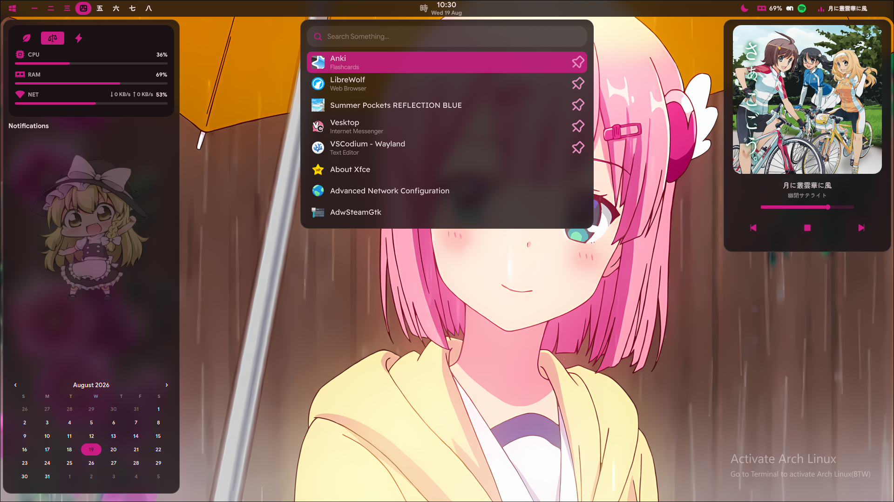
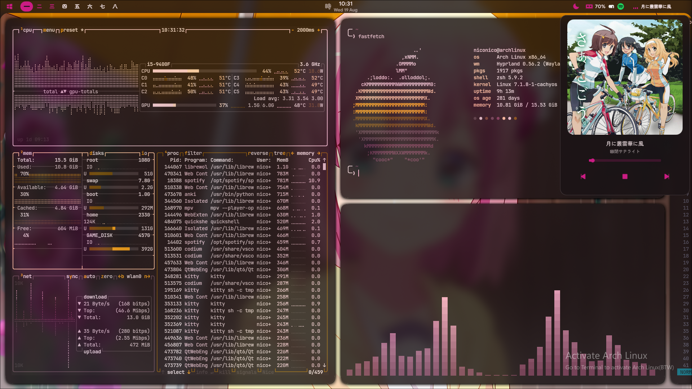

# "Mac-Os-Like" Shell

> 宇宙を飛び不思議な巫女。。。


---



##




## Keeping Track Of:

| Tool | Description | Configuration Path |
| :--- | :--- | :--- |
| **Shell** | Zsh configs & custom aliases | `~/.zshrc` |
| **Hyprland** | The config files for hyprland | `~/.config/hypr` |
| **Quickshell** | Bar, Modules, etc... | `~/.config/quickshell` |
| **Editor** | Neovim plugins, keymaps, and LSP settings | `~/.config/nvim/` |
| **Matugen** | Get your wallpaper's color across the setup | `~/.config/matugen`
---

```bash
# Clone the Repo:
git clone https://github.com/Dxd231/dotfiles.git

